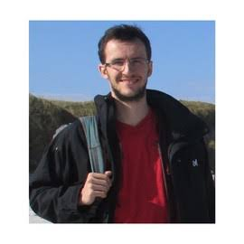
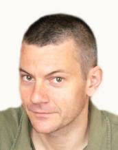

## Sophie Donnet {.unnumbered}

::: {.columns}

::: {.column width="30%"}

:::

::: {.column width="5%"}

::: 
::: {.column width="65%"}

[Sophie Donnet](https://sophiedonnet.github.io/) is a statistician and researcher at INRAE at [MIA-Paris-Saclay](https://mia-ps.inrae.fr/) research laboratory. Her research focuses on statistical methodology for complex biological and ecological systems, with particular emphasis on latent variable models, mixture models, and network inference. She develops statistical methods for analysing structured and high-dimensional data arising in ecology and the life sciences. Her work combines methodological developments in statistical modelling with applications to biological and ecological questions.

:::

:::

## Pierre Gloaguen {.unnumbered}

::: {.columns}

::: {.column width="30%"}

:::

::: {.column width="5%"}

::: 
::: {.column width="65%"}

[blabla]
:::

:::

## Stéphane Robin  {.unnumbered}

::: {.columns}

::: {.column width="30%"}

:::

::: {.column width="5%"}

::: 
::: {.column width="65%"}

[blabla]
:::

:::

